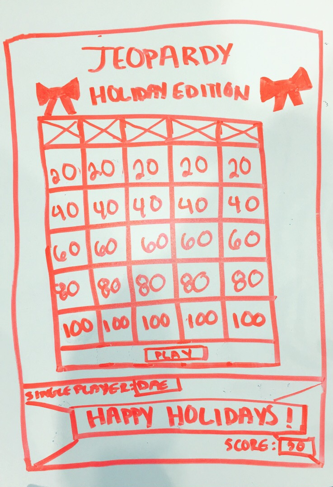

# project1

JEOPARDY

General Assembly SEI December 9 - Project 1

[Deployed Game](https://mystifying-jepsen-475625.netlify.com/)

[Trello Board](https://trello.com/b/mDQRZbof/project-1-board)

[GitHub](https://github.com/dasianejones/Jeopardy)

OVERVIEW

Objective of this project was to use HTML, CSS, and JavaScript skills to create a functioning game that could be played via deployed website. I created my own rendition of Jeopardy based on what I believed to be a "Holiday Edition" of the show.

- input picture of app \*

GAME INSTRUCTIONS:

Play individually

Pick a category and a point value.

Click on the chosen box for the question.

User gives answer via multiple choice selection before clicking again.

If the user is correct, they are awarded the point value of the question. (Can be seen via the “Score” button located at the top of the main board)

Continue until all questions have been answered. The team with the most points wins.

WIREFRAME

TECHNOLOGIES USED

. HTML

. Javascript

. Jquery

. Bootstrap

FUTURE DEVELOPMENTS/ IMPROVEMENTS

. Make game multiplayer

. Add interactive background

. Fix appending issue

. Fix when bonus question comes on

. Create memory for top scores to be saved

<!-- PSEUDOCODE

* create pop up that gives users instructions on how to play Jeopardy *

1) create a single player mode

2) create categories that align with chosen theme

    . pick a category and its associated point value

Categories

     . Category needs a few clickable elements beneath them that are worth a variety of points.

- These elements need to be:

     . Clickable
     . Store a value (the points it’s worth)
     . Disappear or disable themselves after they’ve been selected.

Category tasks:
     . Be clickable
     . Store the value of the selected element.
     . Take that value and add it to the player points if the correct answer was selected.

3) answer question in alotted time period

    . when category is clicked, 10 second timer begins
    . if question is answered before 10 second timer ends, points are awarded
    . if question is not answered before 10 second timer ends, no points are awarded

- Timer needs to do 3 things

    . Start.
    . Countdown
    . Check if the correct answer was chosen, and if not display something.

- Timer task:

    . onClick that listens for when a user clicks a category.
    . startTimer() function to start the countdown.
    . if/else statement you check if an answer was chosen before time runs out.

* create a function that will make each cateogory return a response of correct or incorrect *
* create a variable that calls total score *
* create another function that adds total score *

4) If correct, say "Correct" and award associated points

    . if correct, return point value to total score

5) if incorrect, say "Incorrect" and follow up with correct answer response.

    . if it is incorrect, return correct response answer

6) Game continues until all questions have been answered and/or points recieved.

    . create a function that will know when all questions have been answered

7) If player earns more than 2000, points, they win the game.

    . create a function that knows when total score value reaches 2000 points

8) if player earns less than 2000 points, player loses the game.

    . create a function that will respond with "winner" if user total score is greater than or equal to 2000 points
    . create a function that will respond with "loser" if user total score is under 2000 points -->
